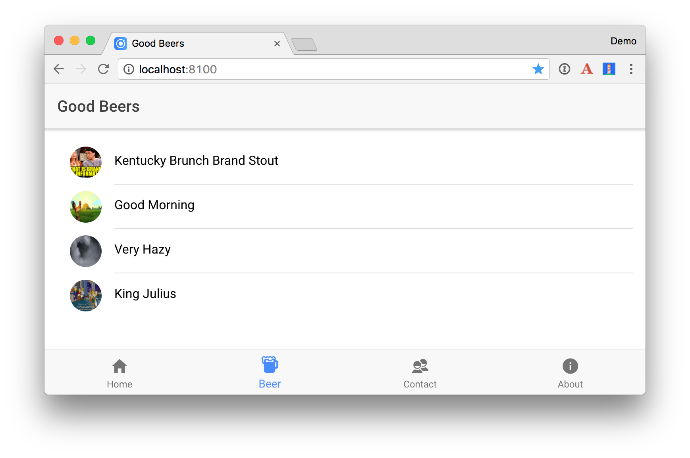
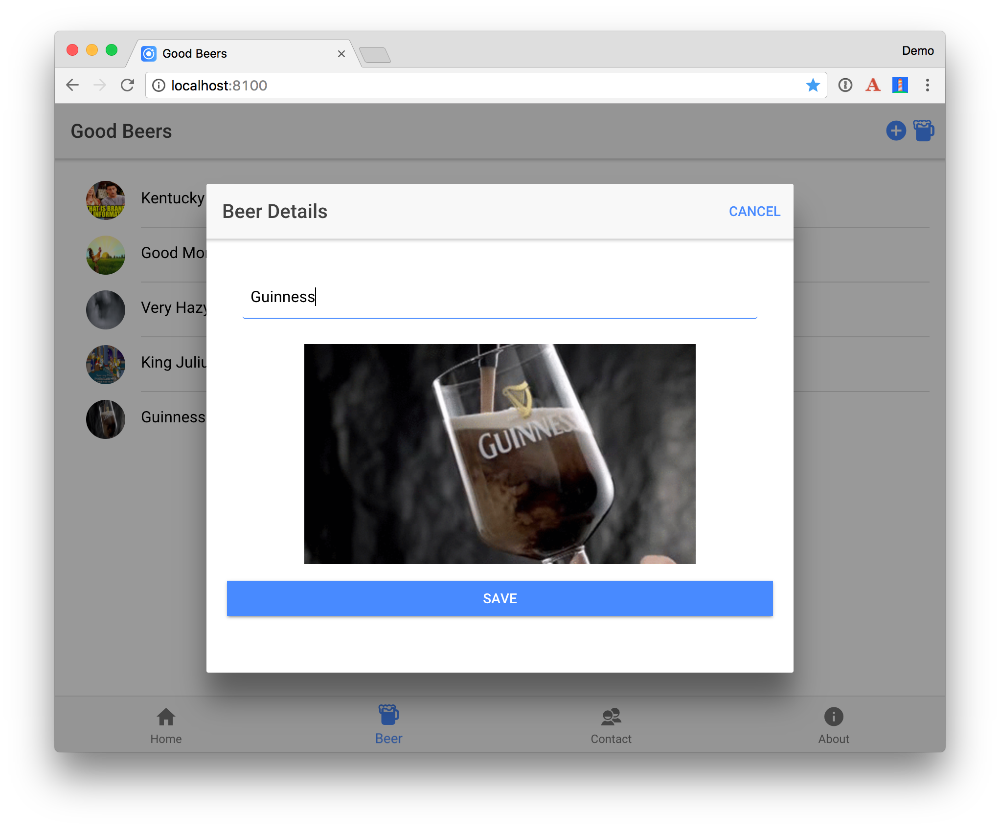
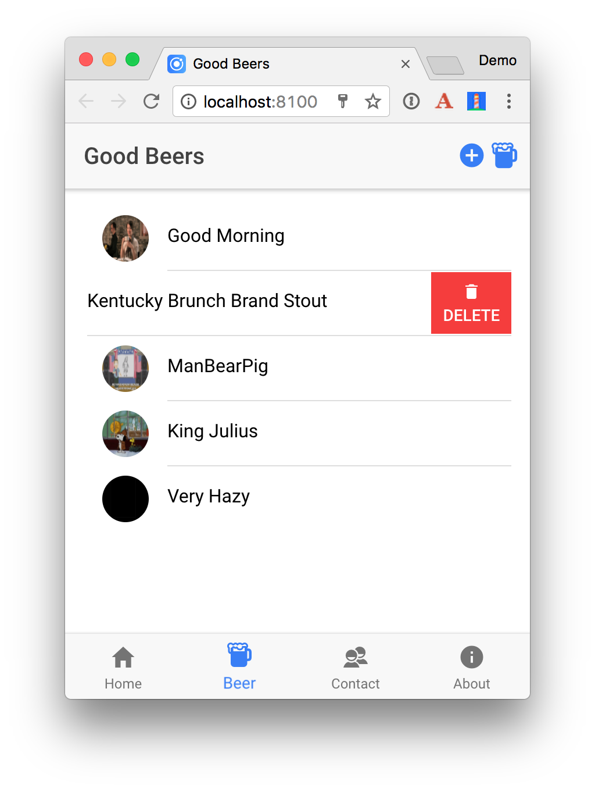

# Spring Boot, Ionic, and Stormpath

This tutorial shows how to build a secure Spring Boot API with Stormpath. It also shows how to build an Ionic app that securely connects to this API and can be deployed to a mobile device.

**Prerequisites**: Java 8, Node.js, Maven, a [Stormpath Account](https://api.stormpath.com/register), and an `apiKey.properties` file in `~/stormpath/`.

## Spring Boot API

Create your Spring Boot API project using [start.spring.io](https://start.spring.io).

```
http https://start.spring.io/starter.zip \
dependencies==data-jpa,data-rest,h2,web,devtools,security,stormpath -d
```

Run the application with `./mvnw spring-boot:run`.

Create a `Beer` entity class in `src/main/java/com/example/beer`.

```java
package com.example.beer;

import javax.persistence.Entity;
import javax.persistence.GeneratedValue;
import javax.persistence.Id;

@Entity
public class Beer {

    @Id
    @GeneratedValue
    private Long id;
    private String name;

    public Beer() {
    }

    public Beer(String name) {
        this.name = name;
    }

    public Long getId() {
        return id;
    }

    public void setId(Long id) {
        this.id = id;
    }

    public String getName() {
        return name;
    }

    public void setName(String name) {
        this.name = name;
    }

    @Override
    public String toString() {
        return "Beer{" +
                "id=" + id +
                ", name='" + name + '\'' +
                '}';
    }
}
```

Create a JPA Repository to manage the `Beer` entity.

```java
package com.example.beer;

import org.springframework.data.jpa.repository.JpaRepository;
import org.springframework.data.rest.core.annotation.RepositoryRestResource;

@RepositoryRestResource
interface BeerRepository extends JpaRepository<Beer, Long> {
}
```

Create a CommandLineRunner to populate the database.

```java
package com.example.beer;

import org.springframework.boot.CommandLineRunner;
import org.springframework.stereotype.Component;

import java.util.stream.Stream;

@Component
class BeerCommandLineRunner implements CommandLineRunner {

    public BeerCommandLineRunner(BeerRepository repository) {
        this.repository = repository;
    }

    @Override
    public void run(String... strings) throws Exception {
        // top 5 beers from https://www.beeradvocate.com/lists/top/
        Stream.of("Good Morning", "Kentucky Brunch Brand Stout", "ManBearPig", "King Julius",
                "Very Hazy", "Budweiser", "Coors Light", "PBR").forEach(name ->
                repository.save(new Beer(name))
        );
        System.out.println(repository.findAll());
    }

    private final BeerRepository repository;
}
```

Create a `BeerController` for your REST API. Add some business logic that results in a `/good-beers` endpoint.

```java
package com.example.beer;

import org.springframework.web.bind.annotation.GetMapping;
import org.springframework.web.bind.annotation.RestController;

import java.util.Collection;
import java.util.HashMap;
import java.util.Map;
import java.util.stream.Collectors;

@RestController
public class BeerController {
    private BeerRepository repository;

    public BeerController(BeerRepository repository) {
        this.repository = repository;
    }

    @GetMapping("/good-beers")
    public Collection<Map<String, String>> goodBeers() {

        return repository.findAll().stream()
                .filter(this::isGreat)
                .map(b -> {
                    Map<String, String> m = new HashMap<>();
                    m.put("id", b.getId().toString());
                    m.put("name", b.getName());
                    return m;
                }).collect(Collectors.toList());
    }

    private boolean isGreat(Beer beer) {
        return !beer.getName().equals("Budweiser") &&
                !beer.getName().equals("Coors Light") &&
                !beer.getName().equals("PBR");
    }
}

```

Access the API using `http localhost:8080/good-beers --auth <user>:<password>`.

## Ionic App

Install Ionic and Cordova: `yarn global add cordova ionic`

From a terminal window, create a new application using the following command:

```
ionic start ionic-auth --v2
```

This may take a minute or two to complete, depending on your internet connection speed. In the same terminal window, change to be in your application’s directory and run it.

```
cd ionic-auth
ionic serve
```

This will open your default browser on [http://localhost:8100](http://localhost:8100). You can click through the tabbed interface to see the default structure of the app.

Thanks to the [recent release of Stormpath's Client API](https://stormpath.com/blog/client-api-authentication-mobile-frontend), you can now authenticate directly without needing to hit your server with a Stormpath SDK integration installed. This article shows you how to do just that in an Ionic application.

Install the [Angular components for Stormpath](https://github.com/stormpath/stormpath-sdk-angular):

```
yarn add angular-stormpath
```

Modify `app.module.ts` to import the appropriate Stormpath classes from `angular-stormpath`. Create a function to configure the `endpointPrefix` to point to the DNS label for your Client API instance. 

**NOTE:** You can find and configure your DNS label by logging into https://api.stormpath.com and navigating to Applications > My Application > Policies > Client API > DNS Label. Since mine is “raible”, I’ll be using `raible.apps.stormpath.io` for this example.

Make sure to define `stormpathConfig`, override the provider, import `StormpathModule` / `StormpathIonicModule`, and append Stormpath's pre-built Ionic pages to `entryComponents`.


```typescript
import {
  StormpathConfiguration, StormpathModule, StormpathIonicModule,
  LoginPage, RegisterPage, ForgotPasswordPage
} from 'angular-stormpath';
...
export function stormpathConfig(): StormpathConfiguration {
  let spConfig: StormpathConfiguration = new StormpathConfiguration();
  spConfig.endpointPrefix = 'https://raible.apps.stormpath.io';
  return spConfig;
}

@NgModule({
  ...
  imports: [
    IonicModule.forRoot(MyApp),
    StormpathModule,
    StormpathIonicModule
  ],
  bootstrap: [IonicApp],
  entryComponents: [
    ...
    LoginPage,
    ForgotPasswordPage,
    RegisterPage
  ],
  providers: [
    {provide: ErrorHandler, useClass: IonicErrorHandler},
    {provide: StormpathConfiguration, useFactory: stormpathConfig}
  ]
})
export class AppModule {}
```

To render a login page before users can view the application, you can modify `src/app/app.component.ts` to use the `Stormpath` service and navigate to Stormpath's `LoginPage` if the user is not authenticated. 

```typescript
import { Component } from '@angular/core';
import { Platform } from 'ionic-angular';
import { StatusBar, Splashscreen } from 'ionic-native';
import { TabsPage } from '../pages/tabs/tabs';
import { Stormpath, LoginPage } from 'angular-stormpath';

@Component({
  templateUrl: 'app.html'
})
export class MyApp {
  rootPage;

  constructor(platform: Platform, private stormpath: Stormpath) {
    stormpath.user$.subscribe(user => {
      if (!user) {
        this.rootPage = LoginPage;
      } else {
        this.rootPage = TabsPage;
      }
    });

    platform.ready().then(() => {
      // Okay, so the platform is ready and our plugins are available.
      // Here you can do any higher level native things you might need.
      StatusBar.styleDefault();
      Splashscreen.hide();
    });
  }
}
```

If you run `ionic serve`, you’ll likely see something similar to the following error in your browser’s console.

```
XMLHttpRequest cannot load https://raible.apps.stormpath.io/me. Response to preflight request
doesn't pass access control check: No 'Access-Control-Allow-Origin' header is present on 
the requested resource. Origin 'http://localhost:8100 is therefore not allowed access. 
The response had HTTP status code 403.
```

To fix this, you’ll need to login to https://api.stormpath.com, navigate to Applications > My Application, and modify the **Authorized Origin URIs** to include `http://localhost:8100`. 

At this point, you should see a login screen when you run `ionic serve`.


If you don’t see this screen, it’s possible you’re still logged in. Clearing your local storage will fix this, or you can continue below to add the ability to logout.

In `src/pages/home.html`, add a logout link to the header and a paragraph in the content section that shows the currently logged in user.

```html
<ion-header>
  <ion-navbar>
    <ion-title>Home</ion-title>
    <ion-buttons end>
      <button ion-button icon-only (click)="logout()">
        Logout
      </button>
    </ion-buttons>
  </ion-navbar>
</ion-header>

<ion-content padding>
  ...
  <p *ngIf="(user$ | async)">
    You are logged in as: <b>{{ ( user$ | async ).fullName }}</b>
  </p>
</ion-content>
```

If you login, the “Logout” button will render, but won’t work because there’s no `logout()` method in `src/pages/home.ts`. Similarly, the “You are logged in” message won’t appear because there’s no `user$` variable defined. Change the body of `home.ts` to retrieve `user$` from the `Stormpath` service and define the `logout()` method.

```typescript
import { Account, Stormpath } from 'angular-stormpath';
import { Observable } from 'rxjs';
...
export class HomePage {
  user$: Observable<Account | boolean>;

  constructor(private stormpath: Stormpath) {
    this.user$ = this.stormpath.user$;
  }

  logout(): void {
    this.stormpath.logout();
  }
}
```

If you’re logged in, you should see a screen with a logout button and the name of the currently logged in user.


The `LoginPage` tries to auto-focus onto the `email` field when it loads. To auto-activate the keyboard you'll need to tell Cordova it’s OK to display the keyboard without user interaction. You can do this by adding the following to `config.xml` in the root directory.

```xml
<preference name="KeyboardDisplayRequiresUserAction" value="false" />
```

Check your changes into Git.

```
git add .
git commit -m "Add Stormpath"
```

## Build a Good Beers UI

Run `ionic generate page beer` to create a component and a template to display the list of good beers. 

Add `BeerPage` to the `declarations` and `entryComponent` lists in `app.module.ts`.

Run `ionic generate provider beer-service` to create a service to fetch the beer list from the Spring Boot API.

Change `src/providers/beer-service.ts` to use have a `getGoodBeers()` method.

```typescript
import { Injectable } from '@angular/core';
import { Http, Response } from '@angular/http';
import 'rxjs/add/operator/map';
import { Observable } from 'rxjs';
import { StormpathConfiguration } from 'angular-stormpath';

@Injectable()
export class BeerService {
  public API;
  public BEER_API;

  constructor(public http: Http, public config: StormpathConfiguration) {
    this.API = config.endpointPrefix;
    this.BEER_API = this.API + '/beers';
  }

  getGoodBeers(): Observable<any> {
    return this.http.get(this.API + '/good-beers')
      .map((response: Response) => response.json());
  }
}
```

Modify `beer.html` to show the list of beers.

```html
<ion-header>
  <ion-navbar>
    <ion-title>Good Beers</ion-title>
  </ion-navbar>

</ion-header>

<ion-content padding>
  <ion-list>
    <ion-item *ngFor="let beer of beers" >
      <ion-item>
        <h2>{{beer.name}}</h2>
      </ion-item>
    </ion-item>
  </ion-list>
</ion-content>
```

Update `beer.ts` to import `BeerService` and add as a provider. Call the `getGoodBeers()` method in the `ionViewDidLoad()` lifecycle method.

```typescript
import { Component } from '@angular/core';
import { BeerService } from '../../providers/beer-service';

@Component({
  selector: 'page-beer',
  templateUrl: 'beer.html',
  providers: [BeerService]
})
export class BeerPage {
  private beers: Array<any>;

  constructor(public beerService: BeerService) {
  }

  ionViewDidLoad() {
    this.beerService.getGoodBeers().subscribe(beers => {
      this.beers = beers;
    })
  }
}
```

To expose this page on the tab bar, add it to `tabs.ts`

```typescript
import { Component } from '@angular/core';

import { HomePage } from '../home/home';
import { AboutPage } from '../about/about';
import { ContactPage } from '../contact/contact';
import { BeerPage } from '../beer/beer';

@Component({
  templateUrl: 'tabs.html'
})
export class TabsPage {
  // this tells the tabs component which Pages
  // should be each tab's root Page
  tab1Root: any = HomePage;
  tab2Root: any = BeerPage;
  tab3Root: any = ContactPage;
  tab4Root: any = AboutPage;

  constructor() {
  }
}
```

Update `tabs.html` too!

```html
<ion-tabs>
  <ion-tab [root]="tab1Root" tabTitle="Home" tabIcon="home"></ion-tab>
  <ion-tab [root]="tab2Root" tabTitle="Beer" tabIcon="beer"></ion-tab>
  <ion-tab [root]="tab3Root" tabTitle="Contact" tabIcon="contacts"></ion-tab>
  <ion-tab [root]="tab4Root" tabTitle="About" tabIcon="information-circle"></ion-tab>
</ion-tabs>
```

Add some fun with Giphy! Run `ionic generate provider giphy-service`. Replace the code in `src/providers/giphy-service.ts` with the following TypeScript:

```typescript
import { Injectable } from '@angular/core';
import { Http, Response } from '@angular/http';
import { Observable } from 'rxjs';

@Injectable()
// http://tutorials.pluralsight.com/front-end-javascript/getting-started-with-angular-2-by-building-a-giphy-search-application
export class GiphyService {

  giphyApi = 'https://api.giphy.com/v1/gifs/search?api_key=dc6zaTOxFJmzC&q=';

  constructor(public http: Http) {
  }

  get(searchTerm): Observable<any> {
    let apiLink = this.giphyApi + searchTerm;
    return this.http.request(apiLink).map((res: Response) => {
      let results = res.json().data;
      if (results.length > 0) {
        return results[0].images.original.url;
      } else {
        return 'https://media.giphy.com/media/YaOxRsmrv9IeA/giphy.gif'; // dancing cat for 404
      }
    });
  }
}
```

Update `beer.ts` to take advantage of `GiphyService`:

```typescript
import { Component } from '@angular/core';
import { BeerService } from '../../providers/beer-service';
import { GiphyService } from '../../providers/giphy-service';

@Component({
  selector: 'page-beer',
  templateUrl: 'beer.html',
  providers: [BeerService, GiphyService]
})
export class BeerPage {
  private beers: Array<any>;

  constructor(public beerService: BeerService, public giphyService: GiphyService) {
  }

  ionViewDidLoad() {
    this.beerService.getGoodBeers().subscribe(beers => {
      this.beers = beers;
      for (let beer of this.beers) {
        this.giphyService.get(beer.name).subscribe(url => {
          beer.giphyUrl = url
        });
      }
    })
  }
}
```

Update `beer.html` to display the image retrieved:

```html
<ion-item>
    <ion-avatar item-left>
      
    </ion-avatar>
    <h2>{{beer.name}}</h2>
</ion-item>
```

If everything works as expected, you should see a page similar to the one below in your browser.

<p align="center">

</p>

### Add a Modal for Editing

Change the header in `beer.html` to have a button that opens a modal to add a new beer.

```html
<ion-header>
  <ion-navbar>
    <ion-title>Good Beers</ion-title>
    <ion-buttons end>
      <button ion-button icon-only (click)="openModal()" color="primary">
        <ion-icon name="add-circle"></ion-icon>
        <ion-icon name="beer"></ion-icon>
      </button>
    </ion-buttons>
  </ion-navbar>
```

In this same file, change `<ion-item>` to have a click handler for opening the modal for the current item.

```html
<ion-item (click)="openModal({id: beer.id})">
```

Add `ModalController` as a dependency in `BeerPage` and add an `openModal()` method.

```typescript
export class BeerPage {
  private beers: Array<any>;

  constructor(public beerService: BeerService, public giphyService: GiphyService,
              public modalCtrl: ModalController) {
  }

  // ionViewDidLoad method

  openModal(beerId) {
    let modal = this.modalCtrl.create(BeerModalPage, beerId);
    modal.present();
    // refresh data after modal dismissed
    modal.onDidDismiss(() => this.ionViewDidLoad())
  }
}
```

This won't compile because `BeerModalPage` doesn't exist. Create `beer-modal.ts` in the same directory. This page will retrieve the beer from the `beerId` that's passed in. It will render the name, allow it to be edited, and show the Giphy image found for the name.

```typescript
import { BeerService } from '../../providers/beer-service';
import { Component, ViewChild } from '@angular/core';
import { GiphyService } from '../../providers/giphy-service';
import { NavParams, ViewController, ToastController, NavController } from 'ionic-angular';
import { NgForm } from '@angular/forms';

@Component({
  templateUrl: './beer-modal.html'
})
export class BeerModalPage {
  @ViewChild('name') name;
  beer: any = {};
  error: any;

  constructor(public beerService: BeerService,
              public giphyService: GiphyService,
              public params: NavParams,
              public viewCtrl: ViewController,
              public toastCtrl: ToastController,
              public navCtrl: NavController) {
    if (this.params.data.id) {
      this.beerService.get(this.params.get('id')).subscribe(beer => {
        this.beer = beer;
        this.beer.href = beer._links.self.href;
        this.giphyService.get(beer.name).subscribe(url => beer.giphyUrl = url);
      });
    }
  }

  dismiss() {
    this.viewCtrl.dismiss();
  }

  save(form: NgForm) {
    let update: boolean = form['href'];
    this.beerService.save(form).subscribe(result => {
      let toast = this.toastCtrl.create({
        message: 'Beer "' + form.name + '" ' + ((update) ? 'updated' : 'added') + '.',
        duration: 2000
      });
      toast.present();
      this.dismiss();
    }, error => this.error = error)
  }

  ionViewDidLoad() {
    setTimeout(() => {
      this.name.setFocus();
    },150);
  }
}
```

Create `beer-modal.html` as a template for this page.

```html
<ion-header>
  <ion-toolbar>
    <ion-title>
      {{beer ? 'Beer Details' : 'Add Beer'}}
    </ion-title>
    <ion-buttons start>
      <button ion-button (click)="dismiss()">
        <span ion-text color="primary" showWhen="ios,core">Cancel</span>
        <ion-icon name="md-close" showWhen="android,windows"></ion-icon>
      </button>
    </ion-buttons>
  </ion-toolbar>
</ion-header>
<ion-content padding>
  <form #beerForm="ngForm" (ngSubmit)="save(beerForm.value)">
    <input type="hidden" name="href" [(ngModel)]="beer.href">
    <ion-row>
      <ion-col>
        <ion-list inset>
          <ion-item>
            <ion-input placeholder="Beer Name" name="name" type="text"
                       required [(ngModel)]="beer.name" #name></ion-input>
          </ion-item>
        </ion-list>
      </ion-col>
    </ion-row>
    <ion-row>
      <ion-col *ngIf="beer" text-center>
        
      </ion-col>
    </ion-row>
    <ion-row>
      <ion-col>
        <div *ngIf="error" class="alert alert-danger">{{error}}</div>
        <button ion-button color="primary" full type="submit"
                [disabled]="!beerForm.form.valid">Save</button>
      </ion-col>
    </ion-row>
  </form>
</ion-content>
```

Add `BeerModalPage` to the `declarations` and `entryComponent` lists in `app.module.ts`.

You'll also need to modify `beer-service.ts` to have `get()` and `save()` methods.

```typescript
get(id: string) {
  return this.http.get(this.BEER_API + '/' + id)
    .map((response: Response) => response.json());
}

save(beer: any): Observable<any> {
  let result: Observable<Response>;
  if (beer['href']) {
    result = this.http.put(beer.href, beer);
  } else {
    result = this.http.post(this.BEER_API, beer)
  }
  return result.map((response: Response) => response.json())
    .catch(error => Observable.throw(error));
}
```

### Add Swipe to Delete

To add swipe-to-delete functionality on the list of beers, open `beer.html` and make it so `<ion-item-sliding>` wraps `<ion-item>` and contains the `*ngFor`. Add a delete button using `<ion-item-options>`.

```html
<ion-content padding>
  <ion-list>
    <ion-item-sliding *ngFor="let beer of beers" >
      <ion-item (click)="openModal({id: beer.id})">
        <ion-avatar item-left>
          
        </ion-avatar>
        <h2>{{beer.name}}</h2>
      </ion-item>
      <ion-item-options>
        <button ion-button color="danger" (click)="remove(beer)"><ion-icon name="trash"></ion-icon> Delete</button>
      </ion-item-options>
    </ion-item-sliding>
  </ion-list>
</ion-content>
```

Add a `remove()` method to `beer.ts`. 

```typescript
remove(beer) {
  this.beerService.remove(beer.id).subscribe(response => {
    for (let i = 0; i < this.beers.length; i++) {
      if (this.beers[i] === beer) {
        this.beers.splice(i, 1);
        let toast = this.toastCtrl.create({
          message: 'Beer "' + beer.name + '" deleted.',
          duration: 2000,
          position: 'top'
        });
        toast.present();
      }
    }
  });
}
```

Add `toastCtrl` as a dependency in the constructor so everything compiles.

```typescript
constructor(public beerService: BeerService, public giphyService: GiphyService,
          public modalCtrl: ModalController, public toastCtrl: ToastController) {
}
```

You'll also need to modify `beer-service.ts` to have a `remove()` method.

```typescript
remove(id: string) {
  return this.http.delete(this.BEER_API + '/' + id)
    .map((response: Response) => response.json());
}
```

After making these additions, you should be able to add, edit and delete beers.

<p align="center">
&nbsp;&nbsp;

</div>

## PWAs with Ionic

Ionic 2 ships with support for creating progressive web apps (PWAs). If you’d like to learn more about what PWAs are, see [Navigating the World of Progressive Web Apps with Ionic 2](http://blog.ionic.io/navigating-the-world-of-progressive-web-apps-with-ionic-2/). 

If you run the [Lighthouse Chrome extension](https://developers.google.com/web/tools/lighthouse/) on this application, you’ll get a mediocre score (54/100).

To register a service worker, and improve the app’s score, uncomment the following block in `index.html`.

```html
<!-- un-comment this code to enable service worker
<script>
  if ('serviceWorker' in navigator) {
    navigator.serviceWorker.register('service-worker.js')
      .then(() => console.log('service worker installed'))
      .catch(err => console.log('Error', err));
  }
</script>-->
```

After making this change, the score should improve. In my tests, it increased to 69/100. The remaining issues were:

* The page body should render some content if its scripts are not available. This could likely be solved with [Angular’s app-shell directives](https://www.npmjs.com/package/@angular/app-shell). 
* Site is not on HTTPS and does not redirect HTTP to HTTPS.
* A couple -1’s in performance for "Cannot read property 'ts' of undefined”. 

If you refresh the app and Chrome doesn’t prompt you to install the app (a PWA feature), you probably need to turn on a couple of features. Copy and paste the following URLs into Chrome and enable each feature.

```
chrome://flags/#bypass-app-banner-engagement-checks
chrome://flags/#enable-add-to-shelf
```

After enabling these flags, you’ll see an error in your browser’s console about `assets/imgs/logo.png` not being found. This files is referenced in `src/manifest.json`. You can fix this by copying a 512x512 PNG into this location or by modifying `manifest.json` accordingly.

## Deploy to a Mobile Device

It’s pretty cool that you’re able to develop mobile apps with Ionic in your browser. However, it’s nice to see the fruits of your labor and see how awesome your app looks on a phone. It really does look and behave like a native app!

To see how your application will look on different devices you can run `ionic serve --lab`. The `--lab` flag opens opens a page in your browser that lets you see how your app looks on different devices. 

### iOS

To emulate or deploy to an iOS device, you’ll need a Mac and a fresh installation of [Xcode](https://developer.apple.com/xcode/). If you’d like to build iOS apps on Windows, Ionic offers an [Ionic Package](http://ionic.io/cloud#packaging) service.

Make sure to open Xcode to complete the installation.

To make your app iOS-capable, add support for it using the following command.

```
ionic platform add ios
```

You’ll need to run `ionic emulate ios` to open your app in Simulator.

The biggest problem I found when running the app in Simulator was that it was difficult to get the keyboard to popup. To workaround this, I used Edit > Hardware > Keyboard > Toggle Software Keyboard when I needed to type text in a field.

To deploy the app to an iPhone, start by plugging your iOS device into your computer. Then run the following commands to install ios-deploy/ios-sim, build the app, and run it on your device.

```
npm install -g ios-deploy ios-sim
ionic build ios
cd platforms/ios/
open ionic-auth.xcodeproj
```

Select your phone as the target in Xcode and click the play button to run your app. The first time you do this, Xcode may spin for a while with a “Processing symbol files” message at the top.

See Ionic’s [deploying documentation](https://ionicframework.com/docs/v2/setup/deploying/) for information on code signing and trusting the app’s certificate.

Once you’re configured your phone, computer, and Apple ID to work, you should be able to open the app and see screens like the ones I captured on my iPhone 6s Plus.

<p align="center">
&nbsp;&nbsp;
&nbsp;&nbsp;

</div>

### Android

To emulate or deploy to an Android device, you’ll first need to install [Android Studio](https://developer.android.com/studio/index.html). As part of the install, it will show you where it installed the Android SDK. Set this path as an ANDROID_HOME environment variable. On a Mac, it should be `~/Library/Android/sdk/`.

Make sure to open Android Studio to complete the installation.

To deploy to the Android emulator, add support for it to the ionic-auth project using the `ionic` command.

```
ionic platform add android
```

If you run `ionic emulate android` you’ll get instructions from about how to create an emulator image.

```
Error: No emulator images (avds) found.
1. Download desired System Image by running: /Users/mraible/Library/Android/sdk/tools/android sdk
2. Create an AVD by running: /Users/mraible/Library/Android/sdk/tools/android avd
HINT: For a faster emulator, use an Intel System Image and install the HAXM device driver
```

I ran the first suggestion and downloaded my desired system image. Then I ran the second command and created an AVD with the following settings:

```
AVD Name: TestPhone
Device: Nexus 5
Target: Android 7.1.1
CPU/ABI: Google APIs Intel Axom (x86_64)
Skin: Skin with dynamic hardware controls
```

After performing these steps, I was able to run `ionic emulate android` and see my app running in the AVD.

## Learn More
I hope you’ve enjoyed this tour of Ionic, Angular, and Stormpath. I like how Ionic takes your web development skills up a notch and allows you to create mobile applications that look and behave natively.

To learn more about Ionic, Angular, or Stormpath, please see the following resources:

* [Get started with Ionic Framework](http://ionicframework.com/getting-started/)
* [Getting Started with Angular](https://www.youtube.com/watch?v=Jq3szz2KOOs) A YouTube webinar by yours truly. ;)
* [Stormpath Client API Guide](https://docs.stormpath.com/client-api/product-guide/latest/) 
